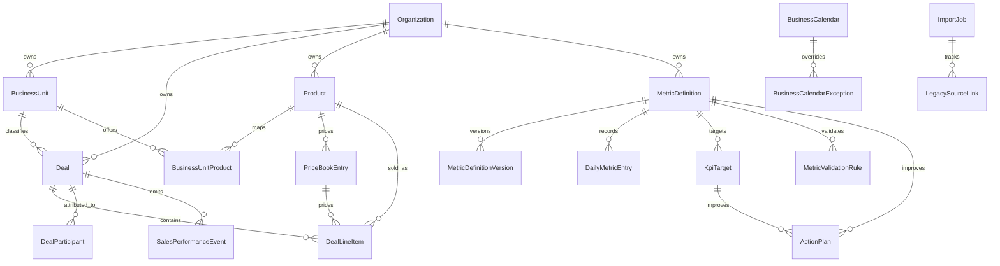

# Phase 2 ER Diagram

## Duplicate Counting Rules

- Won deals: distinct `Deal`.
- Gross profit: sum `DealLineItem.grossProfitAmount`.
- Forecast gross profit: sum `DealLineItem.expectedGrossProfitAmount`.
- Weighted forecast: forecast gross profit multiplied by `ForecastCategory.probability`.
- Meetings: distinct `MeetingBooking` or `SalesPerformanceEvent` depending on source definition.
- Referrals: distinct `Referral`.
- Field visits: distinct `FieldVisit`.
